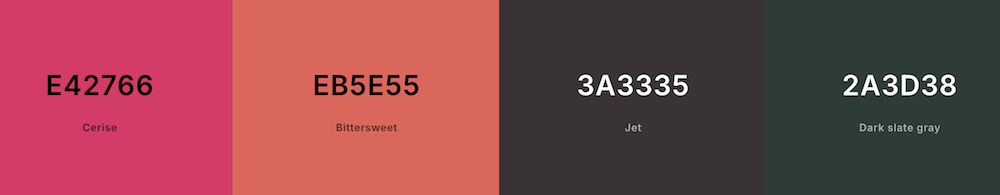
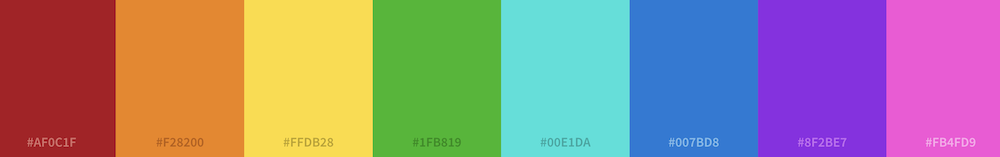

# Pixel Pairs
Milestone Project 2 - Alice Phipps

[Github link](https://github.com/AP071216/mp2)

## Pixel Pairs

This project creates an interactive memory game for users to test their memory in a fun way. It uses a pale pink color palette and and easy to read font that looks clear to all users. The cards have an animation to create a more interesting user experience.

### About Pixel Pairs

Pixel Pairs is designed for users of all ages to be able to put their memory skills to the test, with the implementation of the "best tries" feature, it allows users to be competitive and aim to beat their highest score.

## Table of Contents

1. [UX](#ux)
    - [User Stories](#user-stories)
2. [Design](#design)
    - [Colours](#colours)
    - [Fonts](#fonts)
    - [Icons](#icons)
3. [Wireframes](#wireframes)
    - [Main Page](#main-page)
4. [Deployment](#deployment)
    - [Repository](#repository)
    - [Hosting](#hosting)
5. [Features](#features)
6. [Testing](#testing)
    - [Browser testing](#browser-testing)
    - [Responsive testing](#responsive-testing)
    - [HTML validation](#html-validator)
    - [CSS validation](#css-validator)
    - [JS validation](#js-validator)
    - [Lighthouse](#lighthouse)
7. [Technologies Used](#technologies-used)
8. [Credits and References](#credits-and-references)

## UX

The primary goal of this website is to test a user's memory in an online environment, rather than the common alternatives of physical cards that require you to remember your previous bests or shuffle the cards manually after each turn. This provides a faster alternative that's suitable for all ages

### User Stories

As a user who wants to test my memory, I want:
1. A simple design that allows me to focus on the game
2. A fun animation to keep me engaged whilst playing the game
3. To see the colors of the cards that I have already flipped to keep track of what colors are left
4. A short delay after I flip two non-matching cards so I have time to remember them 
5. A counter to keep track of how many turns I've taken
6. A notification that tells me when I have completed the game and how many turns it took
7. A best tries count so I can aim to beat my record
8. A reset button to reset the game at the end of a round
9. Distinct colours to easily differentiate the cards once flipped

## Design

The website is comprised of one page featuring the game. It provides a clear space to enable easy gameplay.

### Colours
Shades of pink for the main color palette with black and dark green for accent colors and text

Bright colorful shades for the cards for easy distinction. I made the red shade slightly darker to contrast more from the pink on the unflipped cards

### Fonts

I used google fonts to find a clean and easy to read font and decided on "Quicksand"

### Icons

Fontawesome allowed me to find a suitable favicon for the document title, I chose a chessboard as this provided a similar grid to the game board in the game.

## Wireframes

### Main Page

## Deployment

### Repository

### Hosting

## Features

## Testing

### Browser Testing

### Responsive testing

### HTML Validator

### CSS Validator

### JS Validator

### Lighthouse

## Technologies used

### Languages

### Technology

## Credits and References

