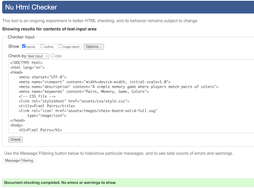
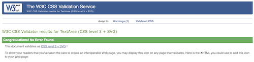
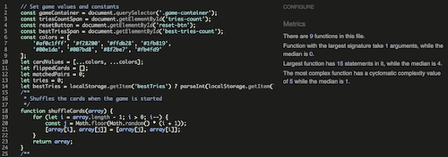

# Pixel Pairs
Milestone Project 2 - Alice Phipps

[Github link](https://github.com/AP071216/mp2)

## Pixel Pairs

This project creates an interactive memory game for users to test their memory in a fun way. It uses a pale pink color palette and and easy to read font that looks clear to all users. The cards have an animation to create a more interesting user experience.

### About Pixel Pairs

Pixel Pairs is designed for users of all ages to be able to put their memory skills to the test, with the implementation of the "best tries" feature, it allows users to be competitive and aim to beat their highest score.

## Table of Contents

1. [UX](#ux)
    - [User Stories](#user-stories)
2. [Gameplay](#gameplay)
3. [Design](#design)
    - [Colours](#colours)
    - [Fonts](#fonts)
    - [Icons](#icons)
4. [Wireframes](#wireframes)
    - [Main Page](#main-page)
5. [Deployment](#deployment)
    - [Repository](#repository)
    - [Hosting](#hosting)
6. [Features](#features)
7. [Testing](#testing)
    - [Browser testing](#browser-testing)
    - [Responsive testing](#responsive-testing)
    - [HTML validation](#html-validator)
    - [CSS validation](#css-validator)
    - [JS validation](#js-validator)
    - [Lighthouse](#lighthouse)
8. [Technologies Used](#technologies-used)
9. [Credits and References](#credits-and-references)

## UX

The primary goal of this website is to test a user's memory in an online environment, rather than the common alternatives of physical cards that require you to remember your previous bests or shuffle the cards manually after each turn. This provides a faster alternative that's suitable for all ages

### User Stories

As a user who wants to test my memory, I want:
1. A simple design that allows me to focus on the game
2. A fun animation to keep me engaged whilst playing the game
3. To see the colors of the cards that I have already flipped to keep track of what colors are left
4. A short delay after I flip two non-matching cards so I have time to remember them 
5. A counter to keep track of how many turns I've taken
6. A notification that tells me when I have completed the game and how many turns it took
7. A best tries count so I can aim to beat my record
8. A reset button to reset the game at the end of a round
9. Distinct colours to easily differentiate the cards once flipped

## Gameplay

How to play:
1. The game starts with all 16 cards face-down.
2. Click on any card to flip it over and reveal its color.
3. Click on a second card.
4. If the two cards match, they will remain face-up.
5. If they do not match, they will flip back over after a short delay, and you can try again.
6. The goal is to find all 8 matching pairs in the fewest number of tries.

## Design

The website is comprised of one page featuring the game. It provides a clear space to enable easy gameplay.

### Colours
Shades of pink for the main color palette with black and dark green for accent colors and text

Bright colorful shades for the cards for easy distinction. I made the red shade slightly darker to contrast more from the pink on the unflipped cards

### Fonts

I used google fonts to find a clean and easy to read font and decided on "Quicksand"

### Icons

Fontawesome allowed me to find a suitable favicon for the document title, I chose a chessboard as this provided a similar grid to the game board in the game.

## Wireframes

### Main Page

In order to keep good game functionality, it was important to keep the page layout the same on a mobile as it would be on a larger screen size. In order to do this I kept the same grid layout but made the cards smaller which allowed the grid to fit on a mobile device.

## Deployment

### Repository

1. Intially I created a public repository on my Github account and copied this to my repository on Visual Studio using the following commands
    - git config --global user.name (add username)
    - git config --global user.email (add email)
    - git config --list
2. Throughout my work on the project, I regularly committed my work to github using the following commands
    - git add .
    - git commit -m "Consise message detailing what was changed"
3. After several commits were made, I then pushed my work to Github using:
    - git push

### Hosting

1. On conception of the project and having completed the initial coding work for the project, I went onto my project repository on github to set up for deployment
2. I went into Settings > Pages and ensured that "Deploy from a branch" was selected the main branch was the branch chosen then pressed save and waited for deployment
3. Once deployed I made sure everything was working as observed in my preview browser to ensure files were properly uploaded

## Features

### Game container

On both mobile and desktop the game container appears the same. This serves as the environment on the website to play the game. It involves a 4x4 grid of boxes (cards) which flip once clicked. It has a rounded edge in two corners and a sharper edge on the other two to create a more interesting appearance without affecting gameplay.

### Cards

The cards appear the same on all screensizes however are slightly smaller to fit the smaller grid. They have a pink back which shows before they are flipped, and a color that has been selected randomly through javascript functions. They are animated with a flip motion to create a more fun and interactive gameplay. Once flipped, if they don't match, they will stay shown for a brief duration then flip back. If they match, they will stay flipped and you can continue with the game.

### Tries counter

Below the games container is a counter for the number of tries the player has made, this updates every turn. When the game is reset, the tries counter resets to zero.

### Best tries count

The best tries counter changes at the end of the game, it updates only if the tries counter number is less than the current best tries count. If the game has never been played an N/A will appear. As the best tries count is saved to local storage on the browser, this allows the player to refresh the page and the count will save their best tries and display the number acordingly. 

### Reset Button

At the bottom of the page, there is a button that resets the game back to the start. This provides a new random shuffle of the cards, returns all the cards to a flipped state and resets the tries count to zero.

### Congratulations message

On completion of the game, a message will appear above the game container. There are two different messages that will show depending on the outcome of the finished game. "New Best Score! You won in X tries!" or "Congratulations! You won in X tries!". If the number of tries taken is lower than the current best score, the first message will pop up, else, it will show the second message.

## Testing

### Manual Testing

To aid in debugging my code throughout, and ensuring everything worked as expected I used python tutor to go through my code step by step to find where issues had arrisen. I regularly checked that variables were being updated or changed correctly using console.log in my code and viewing the output in the dev tools console in the browser. Following completion of the website I manually tested to confirm user stories were being met and the game was working as expected.

1. Clicking a card to make sure it turned over to reveal the color
2. Clicking a different card that didn't match to check that both cards would flip back over
3. On flipping two matching cards, they should remain flipped but keep the color visible 
4. After both cards have been flipped, the tries counter should update by 1 
5. Once all pairs have been found, the correct congratulations message appeared
6. If tries counter < best tries counter, then best tries should update and "New Best" message will be sent
7. Pressing the reset button flips all cards back over and on flipping a card, a different color to last round should be seen, confirming the shuffle function is working correctly
8. If a card is clicked once turned over, nothing happens
9. Clicking on two different already flipped cards doesn't update the tries count
10. If the page is refreshed, best tries count remains displaying the correct value instead of resetting
11. Animation of the card flipping is smooth and not distracting
12. Time delay on flipping the cards back over if they don't match is not too long to slow gameplay but not too fast to make it too difficult to remember

### Browser Testing

### Responsive testing

### HTML Validator

### CSS Validator

### JS Validator

### Lighthouse

## Technologies used

### Languages

### Technology

## Credits and References

